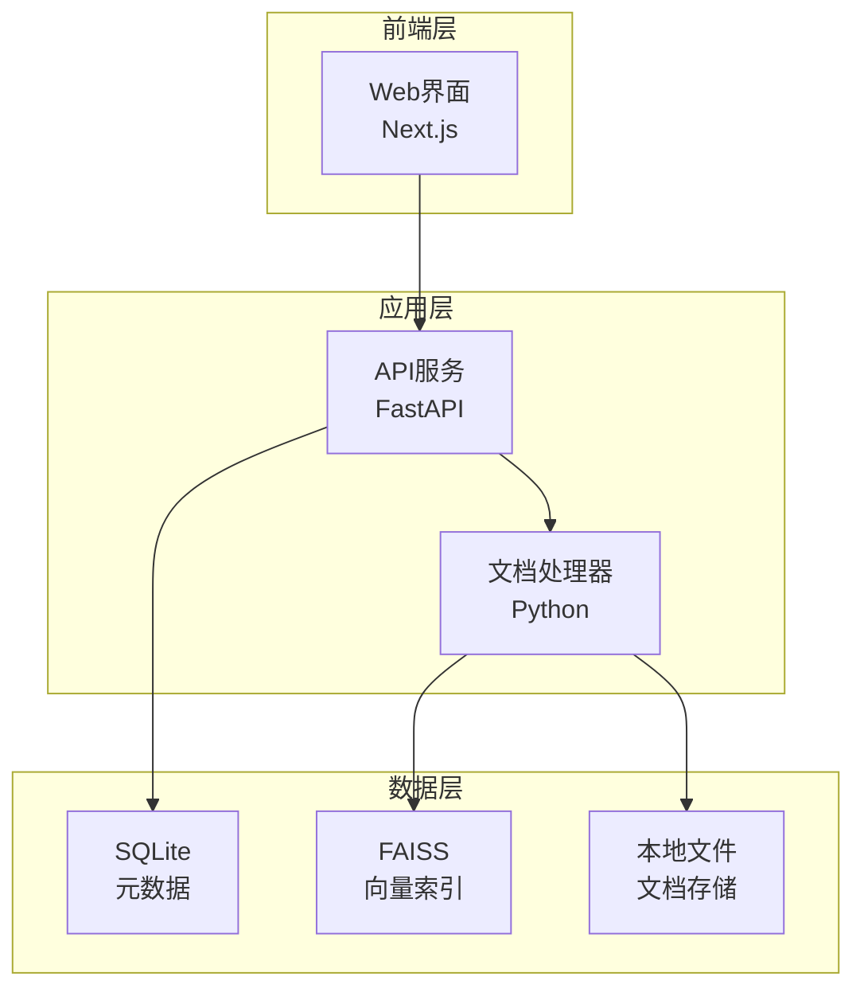
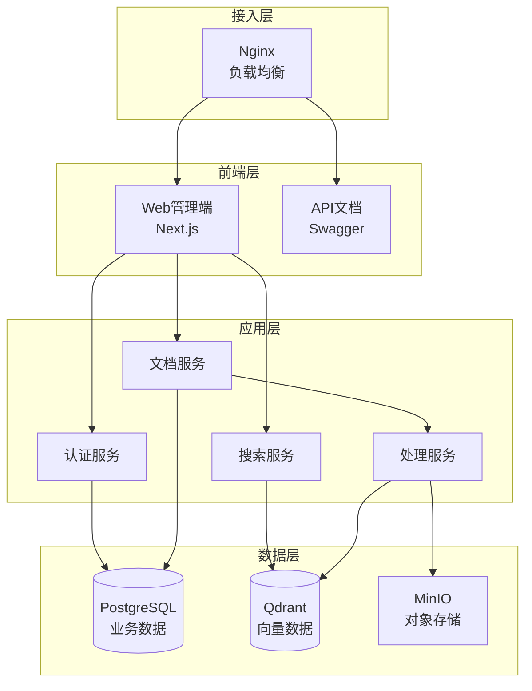
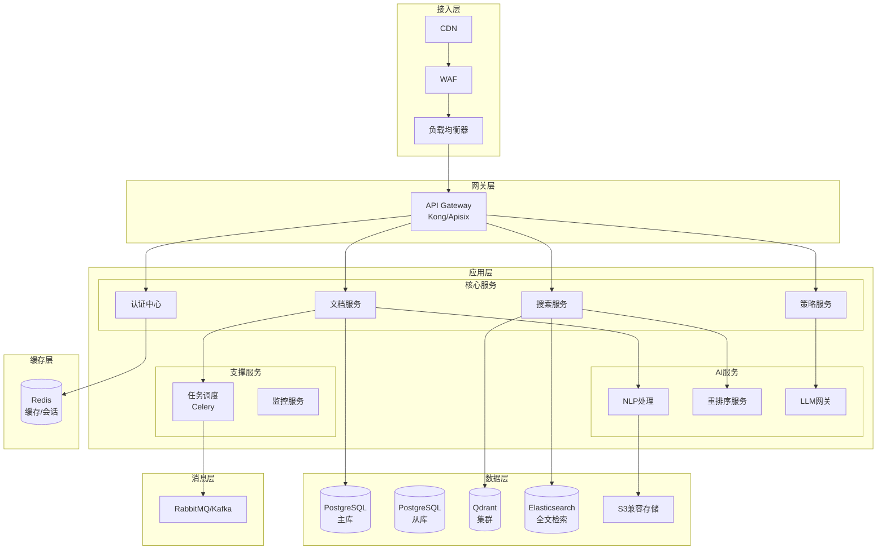
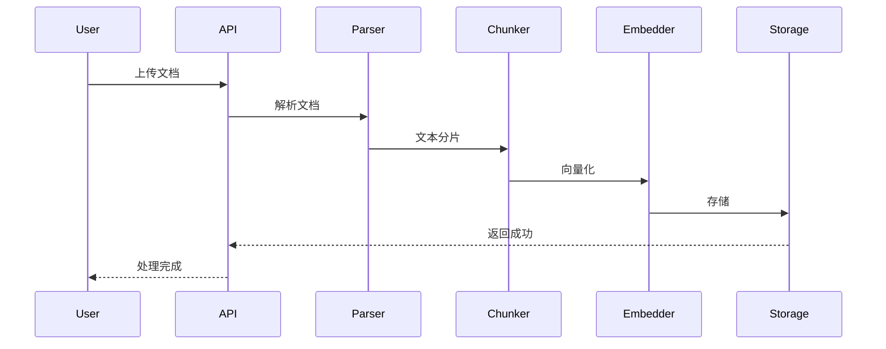
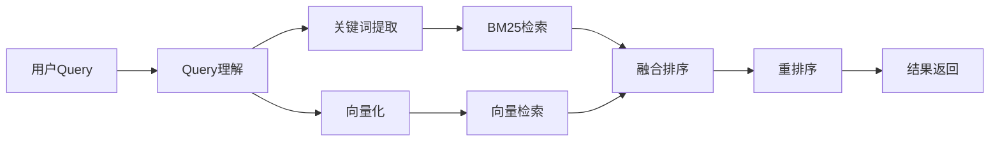
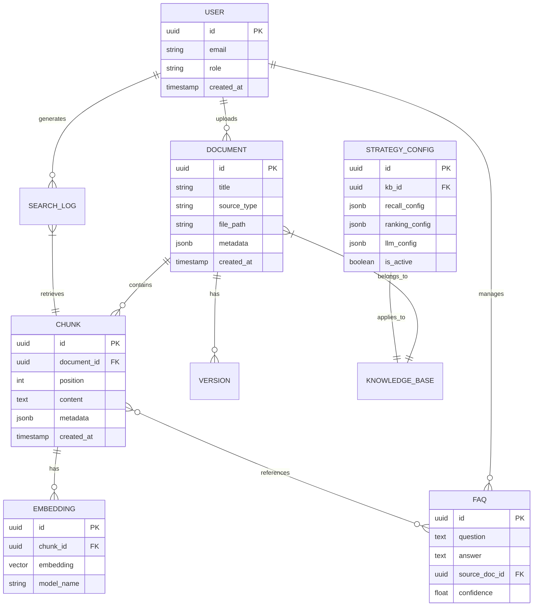
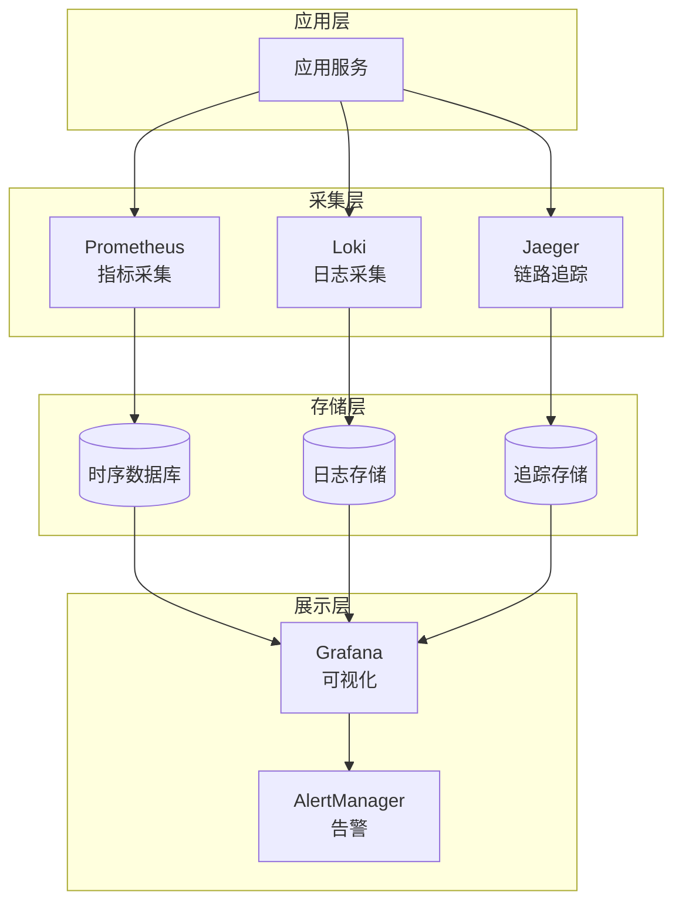
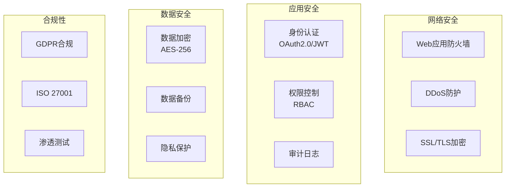
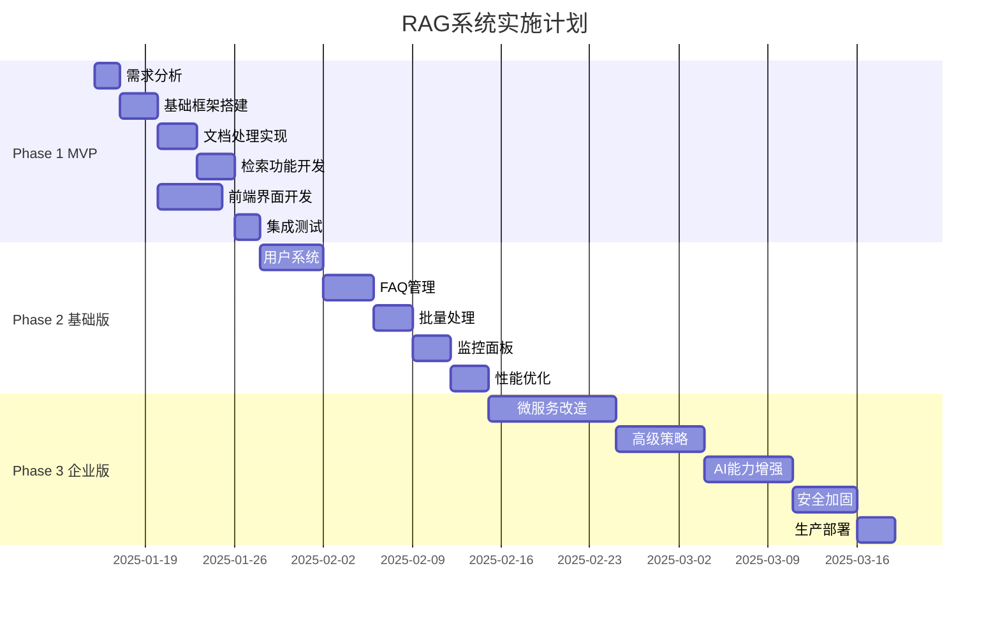

# RAG系统架构设计方案

**版本**：1.0  
**日期**：2025年8月13日  
**架构师**：系统架构团队

---

## 一、架构原则

### 核心理念
1. **渐进式演进**：从MVP开始，逐步扩展功能
2. **实用主义**：优先解决实际问题，避免过度设计
3. **快速迭代**：2周一个版本，持续交付价值
4. **数据驱动**：基于用户反馈和指标优化

---

## 二、整体架构演进路线

### Phase 1: MVP版本（2周）

#### 系统架构图


#### 核心功能
- 文档上传（PDF/TXT/MD）
- 自动分片处理
- 向量化存储
- 简单问答接口

#### 技术栈
```yaml
后端:
  - FastAPI 0.100+
  - SQLite
  - FAISS
  - Sentence-Transformers
  - PyPDF2/python-docx

前端:
  - Next.js 14
  - TailwindCSS
  - shadcn/ui

部署:
  - Docker
  - Nginx
```

---

### Phase 2: 基础功能版（4周）

#### 系统架构图


#### 新增功能
- 用户认证与权限管理
- FAQ管理
- 文档版本控制
- 批量处理能力
- 基础监控面板

---

### Phase 3: 企业级版本（8周）

#### 系统架构图


---

## 三、核心模块设计

### 3.1 文档处理模块

#### 处理流程


#### 分片策略
```python
class ChunkStrategy:
    """分片策略配置"""
    
    STRATEGIES = {
        "fixed": {
            "chunk_size": 500,
            "chunk_overlap": 50
        },
        "semantic": {
            "max_chunk_size": 1000,
            "min_chunk_size": 100,
            "separator": ["\n\n", "\n", "。", "！", "？"]
        },
        "sliding_window": {
            "window_size": 512,
            "stride": 256
        }
    }
```

### 3.2 检索服务模块

#### 混合检索架构


#### 检索配置
```yaml
retrieval:
  semantic:
    model: "sentence-transformers/all-MiniLM-L6-v2"
    top_k: 20
    threshold: 0.7
  
  keyword:
    algorithm: "bm25"
    top_k: 10
    boost: 1.2
  
  fusion:
    method: "rrf"  # Reciprocal Rank Fusion
    weights:
      semantic: 0.6
      keyword: 0.4
  
  rerank:
    model: "cross-encoder/ms-marco-MiniLM-L-6-v2"
    top_k: 5
```

### 3.3 策略干预模块

#### 策略配置模型
```python
@dataclass
class StrategyConfig:
    """策略配置数据模型"""
    
    # 召回策略
    recall_config: dict = field(default_factory=lambda: {
        "semantic_threshold": 0.75,
        "keyword_weight": 0.4,
        "max_candidates": 50
    })
    
    # 排序策略
    ranking_config: dict = field(default_factory=lambda: {
        "rerank_threshold": 0.6,
        "diversity_factor": 0.2,
        "recency_boost": 1.1
    })
    
    # LLM配置
    llm_config: dict = field(default_factory=lambda: {
        "model": "gpt-3.5-turbo",
        "temperature": 0.7,
        "max_tokens": 2048,
        "system_prompt": "你是一个专业的知识助手..."
    })
```

---

## 四、数据模型设计

### 核心实体关系


---

## 五、API设计规范

### RESTful API示例
```yaml
# 文档管理API
POST   /api/v1/documents          # 上传文档
GET    /api/v1/documents          # 文档列表
GET    /api/v1/documents/{id}     # 文档详情
PUT    /api/v1/documents/{id}     # 更新文档
DELETE /api/v1/documents/{id}     # 删除文档

# 搜索API
POST   /api/v1/search             # 执行搜索
GET    /api/v1/search/history     # 搜索历史

# 策略配置API
GET    /api/v1/strategies         # 策略列表
POST   /api/v1/strategies         # 创建策略
PUT    /api/v1/strategies/{id}    # 更新策略
```

### 请求/响应示例
```json
// 搜索请求
{
  "query": "如何配置RAG系统的分片策略",
  "knowledge_base_id": "kb_123",
  "top_k": 5,
  "filters": {
    "document_type": ["pdf", "markdown"],
    "date_range": {
      "start": "2024-01-01",
      "end": "2024-12-31"
    }
  }
}

// 搜索响应
{
  "status": "success",
  "data": {
    "answer": "RAG系统的分片策略配置...",
    "sources": [
      {
        "document_id": "doc_456",
        "chunk_id": "chunk_789",
        "content": "分片策略包括固定大小分片...",
        "score": 0.92,
        "metadata": {
          "page": 15,
          "section": "3.2"
        }
      }
    ],
    "search_id": "search_abc",
    "latency_ms": 234
  }
}
```

---

## 六、部署架构

### 容器化部署（Docker Compose）
```yaml
version: '3.8'

services:
  # API服务
  api:
    build: ./backend
    ports:
      - "8000:8000"
    environment:
      - DATABASE_URL=postgresql://user:pass@db:5432/rag
      - QDRANT_URL=http://qdrant:6333
    depends_on:
      - db
      - qdrant
    volumes:
      - ./data/uploads:/app/uploads
  
  # 前端服务
  frontend:
    build: ./frontend
    ports:
      - "3000:3000"
    environment:
      - API_URL=http://api:8000
  
  # PostgreSQL
  db:
    image: postgres:15
    environment:
      - POSTGRES_DB=rag
      - POSTGRES_USER=user
      - POSTGRES_PASSWORD=pass
    volumes:
      - postgres_data:/var/lib/postgresql/data
  
  # Qdrant向量数据库
  qdrant:
    image: qdrant/qdrant
    ports:
      - "6333:6333"
    volumes:
      - qdrant_data:/qdrant/storage
  
  # Nginx反向代理
  nginx:
    image: nginx:alpine
    ports:
      - "80:80"
    volumes:
      - ./nginx.conf:/etc/nginx/nginx.conf
    depends_on:
      - api
      - frontend

volumes:
  postgres_data:
  qdrant_data:
```

---

## 七、性能指标设计

### 关键性能指标（KPI）
| 指标类别 | 指标名称 | 目标值 | 监控方式 |
|---------|---------|-------|---------|
| 延迟指标 | P50响应时间 | < 200ms | Prometheus |
| | P95响应时间 | < 500ms | Prometheus |
| | P99响应时间 | < 1000ms | Prometheus |
| 吞吐量 | QPS | > 100 | Grafana |
| | 并发用户数 | > 500 | Grafana |
| 准确性 | 检索准确率 | > 85% | 自定义指标 |
| | 答案相关性 | > 80% | 用户反馈 |
| 可用性 | 系统可用率 | > 99.9% | Uptime监控 |
| | 错误率 | < 1% | ELK Stack |

### 监控架构


---

## 八、安全架构设计

### 安全防护体系


### 安全措施清单
- [ ] API速率限制
- [ ] SQL注入防护
- [ ] XSS/CSRF防护
- [ ] 敏感数据脱敏
- [ ] 密钥管理（Vault）
- [ ] 容器安全扫描
- [ ] 代码安全审计

---

## 九、实施计划

### 里程碑计划


---

## 十、风险评估与应对

### 技术风险
| 风险项 | 概率 | 影响 | 应对措施 |
|-------|-----|------|---------|
| 向量检索性能瓶颈 | 中 | 高 | 采用分布式索引，优化向量维度 |
| LLM调用成本过高 | 高 | 中 | 实施缓存策略，使用开源模型 |
| 数据质量问题 | 高 | 高 | 建立数据清洗pipeline |
| 系统扩展性不足 | 低 | 高 | 预留扩展接口，模块化设计 |

### 业务风险
- **用户采纳度低**：MVP快速迭代，收集反馈
- **知识更新不及时**：建立定期更新机制
- **答案准确性不足**：人工审核+用户反馈循环

---

## 十一、成本估算

### 基础设施成本（月度）
```yaml
开发环境:
  - 服务器: 2台 * 4核8G = ¥400
  - 存储: 100GB SSD = ¥50
  - 带宽: 5Mbps = ¥100
  小计: ¥550/月

生产环境:
  - 应用服务器: 4台 * 8核16G = ¥2000
  - 数据库服务器: 2台 * 16核32G = ¥2400
  - 向量数据库: 2台 * 8核16G = ¥1200
  - 存储: 1TB SSD = ¥300
  - CDN: ¥500
  - 带宽: 100Mbps = ¥1000
  小计: ¥7400/月

AI服务:
  - OpenAI API: ¥3000/月（预估）
  - 向量模型部署: ¥1000/月
  小计: ¥4000/月

总计: ¥11,950/月
```

---

## 十二、总结与建议

### 核心价值
1. **渐进式交付**：2周见效果，持续优化
2. **技术债务控制**：避免过度设计，保持简洁
3. **用户驱动**：基于反馈快速迭代
4. **成本可控**：从小规模开始，按需扩展

### 下一步行动
1. **立即开始**：搭建MVP开发环境
2. **组建团队**：2名后端+1名前端+1名算法
3. **制定规范**：代码规范、API规范、文档规范
4. **建立DevOps**：CI/CD流水线
5. **用户试点**：选择5-10个种子用户

### 成功关键
- ✅ 保持专注，不贪大求全
- ✅ 快速迭代，小步快跑
- ✅ 数据驱动，量化决策
- ✅ 用户至上，价值导向

---

> **架构不是设计出来的，是演进出来的。**  
> 让我们从第一行代码开始，构建一个真正有价值的RAG系统。