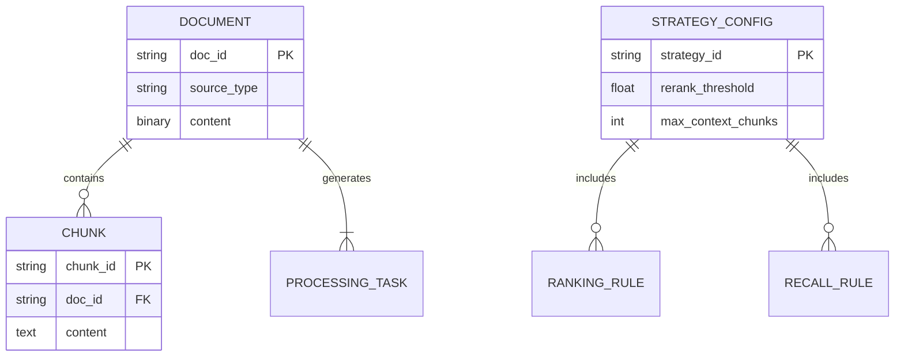

**版本**：1.0  
**日期**：2025年8月12日  

---

## **一、概述**
为RAG系统提供配置管理能力，支持知识管理、搜索引擎优化及策略干预，提升问答效果与系统可控性。

---

## **二、用户角色**
| 角色          | 职责                     |
|---------------|--------------------------|
| 系统管理员    | 全局配置、权限管理       |
| 知识工程师    | 文档/FAQ/片段管理、加工  |
| 算法工程师    | 策略调优、参数配置       |
| 运营人员      | 数据接入、效果监控       |

---

## **三、功能模块详情**
### **1. 知识管理**
#### **(1) FAQ管理**
- **用户故事**：  
  作为知识工程师，我需要批量导入FAQ（CSV/Excel），以便统一管理高频问答对。  
- **功能逻辑**：  
  - 支持拖拽上传/API接入FAQ数据  
  - 表格化展示（问题、答案、来源、状态）  
  - 支持关键词搜索与状态过滤  
- **验证标准**：  
  - 导入1000条FAQ数据耗时 ≤ 5s  
  - 搜索响应时间 ≤ 1s  

#### **(2) 文档管理**
- **用户故事**：  
  作为运营人员，我需要接入PDF/Word/网页等异构数据，并能预览内容。  
- **功能逻辑**：  
  - 数据源管理：本地文件、OSS、API、数据库  
  - 文档预览（文本/图像渲染）  
  - 元数据管理（名称、类型、大小、状态）  
- **验证标准**：  
  - 支持10+格式解析（含OCR识别图片）  
  - 预览加载时间 ≤ 2s  

#### **(3) 片段管理**
- **用户故事**：  
  作为知识工程师，我需要查看文档的分片结果，并可手动调整错误分片。  
- **功能逻辑**：  
  - 按文档树形展示片段（位置、文本预览）  
  - 支持片段合并/拆分/编辑/删除  
  - 标记低质量片段（需人工审核）  
- **验证标准**：  
  - 编辑后片段能实时同步至检索库  

#### **(4) 知识加工**
- **用户故事**：  
  作为算法工程师，我需要自动挖掘文档的FAQ/标签/SPO三元组。  
- **功能逻辑**：  
  - 任务式处理：选择文档 → 选择加工类型 → 启动挖掘  
  - 结果展示：  
    - FAQ：自动生成问答对建议  
    - SPO：可视化实体关系图  
- **验证标准**：  
  - FAQ挖掘准确率 ≥ 80%（人工抽样）  

---

### **2. 搜索引擎**
#### **(1) 数据接入管理**
- **用户故事**：  
  作为运营人员，我需要快速接入第三方数据源（如Notion/Confluence）。  
- **功能逻辑**：  
  - 协议支持：HTTP/API/S3/FTP  
  - 配置化接入：填写端点、认证信息、同步频率  
- **验证标准**：  
  - 新数据源接入配置 ≤ 5分钟  

#### **(2) 数据解析管理**
- **用户故事**：  
  作为系统管理员，我需要为不同文档类型配置专用解析器。  
- **功能逻辑**：  
  - 解析器仓库：预置PDF/PPT/OCR等解析模板  
  - 支持自定义解析脚本（Python）  
- **验证标准**：  
  - 解析错误率 ≤ 1%（千文档抽样）  

---

### **3. 策略干预**
#### **(1) 搜索权重配置**
- **功能逻辑**：  
  - 按文档类型设置权重系数（如PDF:1.2, 网页:0.8）  
  - 支持按知识库目录分级加权  

#### **(2) 分片策略配置**
- **功能逻辑**：  
  ```mermaid
  graph LR
  A[选择文档类型] --> B{分片规则}
  B --> C[语义分片-chunk_size]
  B --> D[标识符分片-按标题]
  B --> E[固定字符分片]
  C --> F[设置chunk_overlap]
  ```

#### **(3) 问答效果干预**
- **核心配置项**：  
  | 模块         | 参数                     | 示例值       |
  |--------------|--------------------------|--------------|
  | 召回规则     | 语义召回阈值            | 0.75         |
  |              | 关键词权重              | 语义60%/关键词40% |
  | 排序规则     | Rerank过滤阈值          | 0.6          |
  |              | 最大参与问答片段数      | 5            |
  | 大模型配置   | 温度值/Top_p            | 0.7/0.9      |
  |              | 最大Token数             | 4096         |

---

## **四、验证标准**
| 模块         | 指标                     | 目标值          |
|--------------|--------------------------|-----------------|
| 知识加工     | SPO挖掘F1值             | ≥ 0.85         |
| 搜索引擎     | 数据同步延迟            | ≤ 5分钟        |
| 策略干预     | 参数调整后问答准确率提升 | ≥ 15%          |
| 系统性能     | 99%请求响应时间         | ≤ 1.5s         |

---

## **五、非功能性需求**
1. **权限控制**：RBAC模型（角色-操作-数据级权限）
2. **审计日志**：记录所有配置变更
3. **系统集成**：提供OpenAPI供外部调用
4. **兼容性**：支持Chrome/Firefox/Safari最新版

---

## **六、数据模型关键设计**


---

## **七、实施路线图**
1. **Phase 1**：文档管理+基础分片策略（4周）
2. **Phase 2**：搜索引擎接入+FAQ挖掘（3周）
3. **Phase 3**：高级策略干预+大模型集成（5周）

---
> 本PRD聚焦核心MVP功能，后续迭代可增加：  
> - 知识图谱可视化  
> - A/B测试效果对比面板  
> - 自动分片质量评估模型