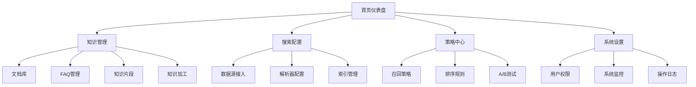
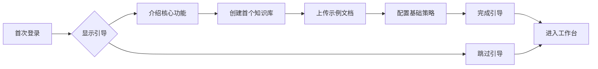
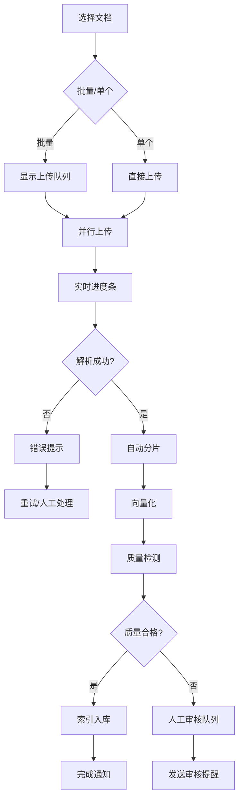

# RAG系统管理后台 UX设计方案

**版本**: 1.0  
**设计师**: UX Team  
**日期**: 2025年8月12日

---

## 一、设计理念

### 1.1 核心原则
- **效率优先**: 3次点击内完成80%核心操作
- **认知负荷最小化**: 渐进式展示复杂信息
- **容错性**: 所有破坏性操作可撤销
- **响应式**: 适配桌面、平板、移动端

### 1.2 设计系统
```
颜色系统:
├── 主色: #1890FF (科技蓝)
├── 成功: #52C41A
├── 警告: #FAAD14
├── 错误: #FF4D4F
└── 中性色: #F0F2F5 - #000000 (10级)

字体系统:
├── 西文: Inter, -apple-system
└── 中文: PingFang SC, Microsoft YaHei

间距系统: 8px 栅格
圆角: 4px / 8px / 16px
阴影: 3级景深
```

---

## 二、信息架构



---

## 三、核心界面设计

### 3.1 Dashboard（仪表盘）

```
┌─────────────────────────────────────────────────────────┐
│ 🏠 RAG管理后台  ⚙️ 设置  🔔 通知(3)  👤 Admin          │
├─────────────────────────────────────────────────────────┤
│                                                         │
│  📊 今日概览                   ⏰ 最近7天              │
│ ┌─────────────┬─────────────┬─────────────┬──────────┐│
│ │ 🔍 查询量   │ 📚 文档总数  │ ⚡ 平均延迟 │ ✅ 准确率││
│ │   12,456    │   89,234    │   245ms    │  92.3%   ││
│ │   ↑ 15.2%   │   ↑ 523     │   ↓ 12ms   │  ↑ 2.1%  ││
│ └─────────────┴─────────────┴─────────────┴──────────┘│
│                                                         │
│ ┌───────────────────────────┬──────────────────────────┐│
│ │ 📈 查询趋势               │ 🎯 热门查询 TOP5        ││
│ │ [实时折线图]              │ 1. 如何重置密码 (2341)  ││
│ │                          │ 2. 产品价格查询 (1823)  ││
│ │                          │ 3. 退货政策说明 (1567)  ││
│ │                          │ 4. 账户注销流程 (1234)  ││
│ │                          │ 5. 发票开具方法 (987)   ││
│ └───────────────────────────┴──────────────────────────┘│
│                                                         │
│ 🔴 系统告警                                             │
│ ┌─────────────────────────────────────────────────────┐│
│ │ ⚠️ 向量索引构建队列积压 234 个文档 [立即处理]        ││
│ │ ⚠️ Token使用量达到月度预算 85% [查看详情]           ││
│ └─────────────────────────────────────────────────────┘│
└─────────────────────────────────────────────────────────┘
```

### 3.2 知识管理界面

```
┌─────────────────────────────────────────────────────────┐
│ 📚 知识管理 > 文档库                                    │
├─────────────────────────────────────────────────────────┤
│ ┌─────────────────────────────────────────────────────┐│
│ │ 🔍 搜索文档...  [文档类型▼] [状态▼] [时间范围▼]    ││
│ │                                                      ││
│ │ [➕ 上传文档] [📥 批量导入] [🔄 同步] [🗑️ 批量删除] ││
│ └─────────────────────────────────────────────────────┘│
│                                                         │
│ ┌─────────────────────────────────────────────────────┐│
│ │ □ 文档名称 ↓     类型    大小    状态    操作        ││
│ ├─────────────────────────────────────────────────────┤│
│ │ □ 📄 产品手册.pdf  PDF   2.3MB   ✅已索引  [👁️][✏️][🗑️]││
│ │ □ 📄 FAQ汇总.xlsx  Excel  156KB   ⏳处理中  [👁️][⏸️][🗑️]││
│ │ □ 🌐 官网内容      网页   -       ✅已索引  [👁️][🔄][🗑️]││
│ │ □ 📄 API文档.md    MD    89KB    ❌失败    [👁️][♻️][🗑️]││
│ └─────────────────────────────────────────────────────┘│
│                                                         │
│ 显示 1-10 / 234 条  [上一页] [1] 2 3 ... 24 [下一页]   │
└─────────────────────────────────────────────────────────┘

点击上传触发拖拽上传界面:
┌─────────────────────────────────────────────────────────┐
│                     上传文档                            │
├─────────────────────────────────────────────────────────┤
│ ┌ ─ ─ ─ ─ ─ ─ ─ ─ ─ ─ ─ ─ ─ ─ ─ ─ ─ ─ ─ ─ ─ ─ ─ ─ ┐ │
│ │                                                     │ │
│ │            📤 拖拽文件到此处或点击选择               │ │
│ │                                                     │ │
│ │     支持格式: PDF, Word, Excel, PPT, TXT, MD       │ │
│ │              单文件最大: 100MB                      │ │
│ └ ─ ─ ─ ─ ─ ─ ─ ─ ─ ─ ─ ─ ─ ─ ─ ─ ─ ─ ─ ─ ─ ─ ─ ─ ┘ │
│                                                         │
│ 上传队列:                                               │
│ ├─ 📄 document1.pdf (2.3MB) ████████████ 100% ✅      │
│ ├─ 📄 document2.docx (1.2MB) ████░░░░░░ 40% ⏳       │
│ └─ 📄 document3.xlsx (500KB) ░░░░░░░░░░ 0% ⏸️        │
│                                                         │
│ [❌ 取消全部] [⏸️ 暂停] [▶️ 继续] [✅ 确认上传]       │
└─────────────────────────────────────────────────────────┘
```

### 3.3 片段管理（创新交互）

```
┌─────────────────────────────────────────────────────────┐
│ 📄 产品手册.pdf > 片段管理                              │
├─────────────────────────────────────────────────────────┤
│ ┌───────────────┬───────────────────────────────────────┐│
│ │ 文档结构树    │ 片段详情                              ││
│ ├───────────────┼───────────────────────────────────────┤│
│ │ 📁 产品手册   │ 片段 #3 (第2页, 第3段)                ││
│ │  ├─ 📄 第1章  │ ┌─────────────────────────────────────┐││
│ │  │  ├─ §1.1  │ │ 原始文本:                           │││
│ │  │  └─ §1.2  │ │ 本产品采用先进的RAG技术，能够实现... │││
│ │  ├─ 📄 第2章  │ └─────────────────────────────────────┘││
│ │  │  ├─ §2.1  │                                        ││
│ │  │  ├─ §2.2  │ 分片信息:                              ││
│ │  │  └─ §2.3✓ │ • Token数: 256                         ││
│ │  └─ 📄 第3章  │ • 向量维度: 1536                       ││
│ │                │ • 质量评分: 0.92 🟢                    ││
│ │ 🔍 搜索片段... │ • 引用次数: 18                         ││
│ └───────────────┴───────────────────────────────────────┘│
│                                                           │
│ 片段操作: [✂️ 拆分] [🔗 合并] [✏️ 编辑] [🗑️ 删除]       │
│                                                           │
│ 可视化片段分布:                                           │
│ ┌─────────────────────────────────────────────────────┐ │
│ │ [███████░░░░░░░░░░░░░░░░░░░░░░░░] 第1章 (25%)      │ │
│ │ [████████████░░░░░░░░░░░░░░░░░░░] 第2章 (40%)      │ │
│ │ [███████████░░░░░░░░░░░░░░░░░░░░] 第3章 (35%)      │ │
│ └─────────────────────────────────────────────────────┘ │
└─────────────────────────────────────────────────────────┘
```

### 3.4 策略配置（可视化编排）

```
┌─────────────────────────────────────────────────────────┐
│ ⚙️ 策略配置 > 检索链路编排                              │
├─────────────────────────────────────────────────────────┤
│                                                         │
│ 可视化策略编排器:                                       │
│ ┌─────────────────────────────────────────────────────┐│
│ │     [查询输入]                                       ││
│ │         ↓                                           ││
│ │   ┌─────────┐                                       ││
│ │   │ 预处理  │ <- 关键词提取, 语义理解                ││
│ │   └────┬────┘                                       ││
│ │        ↓                                           ││
│ │   ┌─────────┬─────────┬─────────┐                  ││
│ │   │向量召回 │关键词召回│ FAQ召回 │ <- 并行执行       ││
│ │   │ (60%)  │  (30%)  │ (10%)  │                   ││
│ │   └────┬────┴────┬────┴────┬────┘                  ││
│ │        └─────────┼─────────┘                       ││
│ │                  ↓                                  ││
│ │           ┌──────────┐                             ││
│ │           │ 结果融合 │ <- RRF算法                   ││
│ │           └─────┬────┘                             ││
│ │                 ↓                                  ││
│ │           ┌──────────┐                             ││
│ │           │ 重排序   │ <- CrossEncoder             ││
│ │           └─────┬────┘                             ││
│ │                 ↓                                  ││
│ │           [输出Top10]                              ││
│ └─────────────────────────────────────────────────────┘│
│                                                         │
│ 参数调优面板:                                           │
│ ┌─────────────────────────────────────────────────────┐│
│ │ 向量召回阈值: [──────●────────] 0.75                ││
│ │ 重排序阈值:   [────────●──────] 0.80                ││
│ │ 最大片段数:   [────●──────────] 5                   ││
│ │ 温度参数:     [──●────────────] 0.1                 ││
│ └─────────────────────────────────────────────────────┘│
│                                                         │
│ [💾 保存配置] [📋 另存为模板] [🔄 恢复默认]             │
└─────────────────────────────────────────────────────────┘
```

---

## 四、交互设计规范

### 4.1 微交互动效

```javascript
// 1. 加载状态 - 骨架屏
const SkeletonLoader = () => (
  <div className="skeleton-wave">
    <div className="skeleton-line" style={{width: '80%'}}/>
    <div className="skeleton-line" style={{width: '60%'}}/>
    <div className="skeleton-line" style={{width: '70%'}}/>
  </div>
);

// 2. 成功反馈 - 渐隐提示
notification.success({
  message: '文档上传成功',
  description: '系统正在处理，预计3分钟完成索引构建',
  duration: 3,
  icon: <CheckCircleOutlined />,
  placement: 'topRight'
});

// 3. 危险操作 - 二次确认
Modal.confirm({
  title: '确认删除',
  content: '删除后无法恢复，是否继续？',
  okText: '确认删除',
  okType: 'danger',
  cancelText: '取消',
  onOk: handleDelete
});
```

### 4.2 快捷键设计

| 快捷键 | 功能 | 场景 |
|--------|------|------|
| `Cmd/Ctrl + K` | 全局搜索 | 全局 |
| `Cmd/Ctrl + N` | 新建文档 | 知识管理 |
| `Cmd/Ctrl + S` | 保存配置 | 策略配置 |
| `Cmd/Ctrl + Z` | 撤销操作 | 编辑页 |
| `Esc` | 关闭弹窗 | 全局 |
| `?` | 快捷键帮助 | 全局 |

### 4.3 响应式断点

```css
/* 移动端优先设计 */
@media (min-width: 576px) { /* 手机横屏 */ }
@media (min-width: 768px) { /* 平板竖屏 */ }
@media (min-width: 992px) { /* 平板横屏 */ }
@media (min-width: 1200px) { /* 桌面 */ }
@media (min-width: 1920px) { /* 大屏 */ }
```

---

## 五、用户流程设计

### 5.1 新手引导流程



### 5.2 文档处理流程（优化版）



---

## 六、无障碍设计

### 6.1 WCAG 2.1 AA级标准

```html
<!-- 1. 语义化标签 -->
<nav role="navigation" aria-label="主导航">
  <ul>
    <li><a href="#knowledge">知识管理</a></li>
  </ul>
</nav>

<!-- 2. 键盘导航 -->
<button 
  tabindex="0"
  onKeyDown={handleKeyDown}
  aria-label="上传文档"
  aria-describedby="upload-help"
>
  <UploadIcon aria-hidden="true" />
  上传文档
</button>

<!-- 3. 屏幕阅读器支持 -->
<div role="alert" aria-live="polite">
  文档上传成功，正在处理中
</div>

<!-- 4. 颜色对比度 -->
/* 确保文字与背景对比度 ≥ 4.5:1 */
.primary-text {
  color: #1a1a1a; /* 对比度 12.6:1 */
  background: #ffffff;
}
```

### 6.2 多语言支持

```javascript
// i18n配置
const messages = {
  'zh-CN': {
    'upload.title': '上传文档',
    'upload.success': '上传成功',
    'upload.failed': '上传失败'
  },
  'en-US': {
    'upload.title': 'Upload Document',
    'upload.success': 'Upload Successful',
    'upload.failed': 'Upload Failed'
  }
};
```

---

## 七、性能优化

### 7.1 前端性能指标

| 指标 | 目标值 | 优化措施 |
|------|--------|----------|
| FCP | < 1.5s | 关键CSS内联 |
| LCP | < 2.5s | 图片懒加载 |
| FID | < 100ms | Web Worker |
| CLS | < 0.1 | 尺寸预留 |

### 7.2 优化策略

```javascript
// 1. 虚拟滚动 - 处理大数据列表
import { VirtualList } from '@tanstack/react-virtual';

// 2. 懒加载路由
const KnowledgeModule = lazy(() => import('./modules/Knowledge'));

// 3. 防抖搜索
const debouncedSearch = useMemo(
  () => debounce(handleSearch, 300),
  []
);

// 4. 缓存策略
const { data } = useQuery({
  queryKey: ['documents', filters],
  queryFn: fetchDocuments,
  staleTime: 5 * 60 * 1000, // 5分钟
  cacheTime: 10 * 60 * 1000 // 10分钟
});
```

---

## 八、错误处理

### 8.1 错误状态设计

```
空状态:
┌─────────────────────────────────────┐
│                                     │
│         🗂️                         │
│     暂无文档                        │
│   点击上传你的第一个文档            │
│                                     │
│     [📤 上传文档]                   │
│                                     │
└─────────────────────────────────────┘

错误状态:
┌─────────────────────────────────────┐
│                                     │
│         ⚠️                          │
│     加载失败                        │
│   请检查网络连接后重试              │
│                                     │
│     [🔄 重试]                       │
│                                     │
└─────────────────────────────────────┘

404状态:
┌─────────────────────────────────────┐
│                                     │
│         🔍                          │
│     页面不存在                      │
│   您访问的页面可能已被移除          │
│                                     │
│     [🏠 返回首页]                   │
│                                     │
└─────────────────────────────────────┘
```

### 8.2 容错机制

```javascript
// 自动重试
const retryStrategy = {
  retries: 3,
  retryDelay: attemptIndex => Math.min(1000 * 2 ** attemptIndex, 30000),
  retryOn: [408, 429, 500, 502, 503, 504]
};

// 降级处理
const fallbackUI = (
  <Card>
    <Result
      status="warning"
      title="功能暂时不可用"
      subTitle="系统正在维护，请稍后再试"
      extra={<Button onClick={reload}>刷新页面</Button>}
    />
  </Card>
);
```

---

## 九、移动端适配

### 9.1 触摸优化

```css
/* 最小点击区域 44x44px */
.touch-target {
  min-width: 44px;
  min-height: 44px;
  padding: 12px;
}

/* 滑动手势 */
.swipeable-list {
  touch-action: pan-y;
  -webkit-overflow-scrolling: touch;
}
```

### 9.2 移动端特殊交互

```javascript
// 长按菜单
const handleLongPress = useLongPress(() => {
  showContextMenu();
}, {
  delay: 500,
  captureEvent: true
});

// 下拉刷新
const { isRefreshing } = usePullToRefresh({
  onRefresh: async () => {
    await refetchData();
  }
});
```

---

## 十、设计盲点与改进建议

### 🚨 你可能忽略的UX问题：

1. **批量操作焦虑**
   - 问题：批量删除500个文档时用户会恐慌
   - 方案：提供"操作预览"和30秒撤销窗口

2. **实时协作冲突**
   - 问题：多人同时编辑策略配置导致覆盖
   - 方案：实时锁定机制 + 操作者头像显示

3. **认知过载**
   - 问题：策略配置参数过多，用户不知如何调优
   - 方案：预设模板 + 智能推荐 + 效果预测

4. **等待焦虑**
   - 问题：大文档处理时间长，用户不知进度
   - 方案：细粒度进度条 + 预计剩余时间 + 后台处理通知

5. **错误恢复困难**
   - 问题：配置错误导致系统异常，难以恢复
   - 方案：配置版本管理 + 一键回滚 + 灰度发布

### 超出常规的创新建议：

1. **AI助手引导**
   ```
   用户: "我想提高问答准确率"
   助手: "基于您的数据特征，建议:
         1. 提高重排序阈值到0.85
         2. 增加FAQ权重到40%
         预计准确率提升: +5.2%"
   ```

2. **可视化调试器**
   - 实时展示检索链路每一步的中间结果
   - 支持断点调试和变量检查

3. **智能异常检测**
   - 自动发现异常查询模式
   - 主动提醒潜在的配置问题

4. **沉浸式配置**
   - VR/AR界面配置知识图谱
   - 3D可视化文档关系网络

---

## 附录A：设计组件库

```javascript
// 核心组件清单
export const ComponentLibrary = {
  // 布局组件
  Layout: ['Header', 'Sidebar', 'Content', 'Footer'],
  
  // 数据展示
  DataDisplay: ['Table', 'Card', 'List', 'Tree', 'Timeline'],
  
  // 数据录入
  DataEntry: ['Form', 'Input', 'Select', 'Upload', 'Switch'],
  
  // 反馈组件
  Feedback: ['Alert', 'Message', 'Notification', 'Progress', 'Skeleton'],
  
  // 导航组件
  Navigation: ['Menu', 'Breadcrumb', 'Tabs', 'Pagination', 'Steps'],
  
  // 业务组件
  Business: [
    'DocumentUploader',    // 文档上传器
    'ChunkEditor',        // 片段编辑器
    'StrategyBuilder',    // 策略构建器
    'MetricsChart',       // 指标图表
    'VectorVisualizer'    // 向量可视化
  ]
};
```

---

## 附录B：设计交付清单

| 交付物 | 格式 | 说明 |
|--------|------|------|
| 设计规范 | Figma | 完整设计系统 |
| 交互原型 | Figma/Principle | 可点击原型 |
| 标注文件 | Zeplin | 开发标注 |
| 切图资源 | SVG/PNG | 2x/3x 图标 |
| 动效说明 | Lottie JSON | 动画参数 |
| 组件文档 | Storybook | 组件示例 |

---

## 更新日志

| 版本 | 日期 | 更新内容 |
|------|------|----------|
| 1.0 | 2025-08-12 | 初始设计方案 |