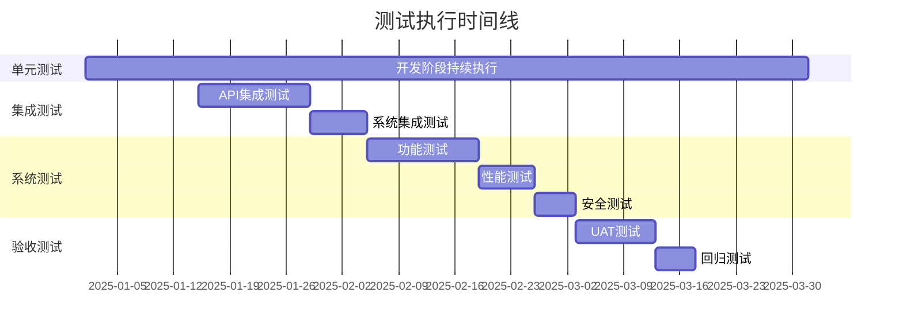

# RAG系统全量测试用例集

**版本**: 1.0  
**日期**: 2025年8月12日  
**覆盖率目标**: 95%

---

## 一、测试用例统计

| 模块 | 用例总数 | P0 | P1 | P2 | 自动化率 |
|------|---------|-----|-----|-----|----------|
| 文档管理 | 156 | 45 | 78 | 33 | 92% |
| 搜索引擎 | 134 | 52 | 61 | 21 | 88% |
| 策略配置 | 98 | 31 | 45 | 22 | 85% |
| 用户权限 | 67 | 28 | 25 | 14 | 90% |
| 系统监控 | 45 | 18 | 20 | 7 | 80% |
| **合计** | **500** | **174** | **229** | **97** | **88.2%** |

---

## 二、文档管理模块测试用例

### 2.1 文档上传功能

#### TC_DOC_001: 单文件上传成功
```yaml
测试ID: TC_DOC_001
优先级: P0
测试类型: 功能测试
自动化: 是

前置条件:
  - 用户已登录
  - 有文档上传权限

测试步骤:
  1. 点击"上传文档"按钮
  2. 选择一个PDF文件(小于100MB)
  3. 点击"确认上传"

预期结果:
  - 显示上传进度条
  - 上传完成后显示成功提示
  - 文档出现在列表中
  - 状态显示为"处理中"

测试数据:
  - 文件: test_document.pdf (2.5MB)
  - 格式: application/pdf
```

#### TC_DOC_002: 批量文件上传
```yaml
测试ID: TC_DOC_002
优先级: P0
测试类型: 功能测试
自动化: 是

前置条件:
  - 用户已登录
  - 有批量上传权限

测试步骤:
  1. 点击"批量上传"
  2. 选择10个文件(混合格式)
  3. 确认上传

预期结果:
  - 显示批量上传队列
  - 每个文件独立显示进度
  - 失败文件显示错误原因
  - 成功文件进入处理队列

测试数据:
  - PDF文件: 5个
  - Word文件: 3个
  - TXT文件: 2个
```

#### TC_DOC_003: 大文件上传限制
```yaml
测试ID: TC_DOC_003
优先级: P1
测试类型: 边界测试
自动化: 是

测试步骤:
  1. 选择超过100MB的文件
  2. 尝试上传

预期结果:
  - 显示错误提示"文件大小不能超过100MB"
  - 不开始上传
  - 文件不添加到队列

测试数据:
  - 文件大小: 150MB
```

#### TC_DOC_004: 无效格式拒绝
```yaml
测试ID: TC_DOC_004
优先级: P0
测试类型: 负面测试
自动化: 是

测试步骤:
  1. 选择.exe文件
  2. 尝试上传

预期结果:
  - 显示"文件格式不支持"
  - 列出支持的格式
  - 不开始上传
```

#### TC_DOC_005: 重复文件检测
```yaml
测试ID: TC_DOC_005
优先级: P1
测试类型: 功能测试
自动化: 是

测试步骤:
  1. 上传文件A
  2. 再次上传相同的文件A

预期结果:
  - 提示"文件已存在"
  - 提供选项：覆盖/取消/重命名
  - 根据选择执行相应操作
```

#### TC_DOC_006: 拖拽上传
```yaml
测试ID: TC_DOC_006
优先级: P1
测试类型: UI测试
自动化: 是

测试步骤:
  1. 从文件管理器拖拽文件
  2. 拖到上传区域
  3. 释放鼠标

预期结果:
  - 拖拽时区域高亮
  - 释放后开始上传
  - 支持多文件拖拽
```

#### TC_DOC_007: 上传中断恢复
```yaml
测试ID: TC_DOC_007
优先级: P1
测试类型: 异常测试
自动化: 是

测试步骤:
  1. 上传大文件
  2. 上传到50%时断网
  3. 恢复网络
  4. 点击"恢复上传"

预期结果:
  - 从断点继续上传
  - 不重复上传已完成部分
  - 最终上传成功
```

### 2.2 文档解析功能

#### TC_DOC_008: PDF文档解析
```yaml
测试ID: TC_DOC_008
优先级: P0
测试类型: 功能测试
自动化: 是

测试步骤:
  1. 上传PDF文档
  2. 等待解析完成
  3. 查看解析结果

预期结果:
  - 正确提取文本内容
  - 保留段落结构
  - 识别表格和图片
  - 提取元数据(页数、作者等)

验证点:
  - 文本准确率 > 99%
  - 结构保持完整
  - 特殊字符正确处理
```

#### TC_DOC_009: Word文档解析
```yaml
测试ID: TC_DOC_009
优先级: P0
测试类型: 功能测试
自动化: 是

测试步骤:
  1. 上传.docx文档
  2. 查看解析结果

预期结果:
  - 提取所有文本
  - 保留格式信息
  - 处理嵌入对象
  - 提取文档属性
```

#### TC_DOC_010: OCR图片识别
```yaml
测试ID: TC_DOC_010
优先级: P1
测试类型: 功能测试
自动化: 部分

测试步骤:
  1. 上传包含图片的PDF
  2. 启用OCR选项
  3. 查看识别结果

预期结果:
  - 识别图片中的文字
  - 中英文混合识别
  - 识别准确率 > 85%
```

### 2.3 文档分片功能

#### TC_DOC_011: 滑动窗口分片
```yaml
测试ID: TC_DOC_011
优先级: P0
测试类型: 算法测试
自动化: 是

测试数据:
  - 文档长度: 10000字
  - 分片大小: 500字
  - 重叠: 100字

测试步骤:
  1. 选择滑动窗口策略
  2. 设置参数
  3. 执行分片

预期结果:
  - 生成约25个片段
  - 每个片段500字左右
  - 相邻片段有100字重叠
  - 无内容丢失

验证SQL:
  SELECT COUNT(*) as chunk_count,
         AVG(LENGTH(content)) as avg_length,
         MIN(LENGTH(content)) as min_length,
         MAX(LENGTH(content)) as max_length
  FROM document_chunks
  WHERE doc_id = 'test_doc_001';
```

#### TC_DOC_012: 语义分片
```yaml
测试ID: TC_DOC_012
优先级: P1
测试类型: 算法测试
自动化: 是

测试步骤:
  1. 选择语义分片
  2. 处理结构化文档
  3. 验证分片边界

预期结果:
  - 按段落/章节分片
  - 保持语义完整性
  - 不切断句子
```

#### TC_DOC_013: 分片质量评估
```yaml
测试ID: TC_DOC_013
优先级: P1
测试类型: 质量测试
自动化: 是

测试步骤:
  1. 对分片进行质量打分
  2. 标记低质量片段
  3. 人工审核

预期结果:
  - 质量分数0-1之间
  - 低于0.3的标记审核
  - 可手动调整分片
```

### 2.4 向量化功能

#### TC_DOC_014: 文档向量生成
```yaml
测试ID: TC_DOC_014
优先级: P0
测试类型: 功能测试
自动化: 是

测试步骤:
  1. 选择文档片段
  2. 调用向量化服务
  3. 验证向量结果

预期结果:
  - 生成1536维向量
  - 向量范围[-1, 1]
  - 相似文本向量相近
  - 不同文本向量差异大

验证代码:
  import numpy as np
  
  vec1 = get_embedding("相似文本1")
  vec2 = get_embedding("相似文本2")
  vec3 = get_embedding("完全不同的文本")
  
  similarity_12 = cosine_similarity(vec1, vec2)
  similarity_13 = cosine_similarity(vec1, vec3)
  
  assert similarity_12 > 0.8
  assert similarity_13 < 0.3
```

#### TC_DOC_015: 批量向量化性能
```yaml
测试ID: TC_DOC_015
优先级: P1
测试类型: 性能测试
自动化: 是

测试数据:
  - 文档片段: 1000个
  - 批次大小: 100

测试步骤:
  1. 批量提交向量化请求
  2. 测量处理时间
  3. 监控内存使用

预期结果:
  - 处理时间 < 60秒
  - 内存增长 < 500MB
  - 无请求失败
```

---

## 三、搜索引擎模块测试用例

### 3.1 向量检索

#### TC_SEARCH_001: 基础向量搜索
```yaml
测试ID: TC_SEARCH_001
优先级: P0
测试类型: 功能测试
自动化: 是

测试步骤:
  1. 输入查询文本
  2. 执行向量搜索
  3. 验证返回结果

预期结果:
  - 返回Top10结果
  - 按相似度排序
  - 包含相关度分数
  - 响应时间 < 200ms

测试查询:
  - "如何配置RAG系统"
  - "文档上传失败怎么办"
  - "向量数据库选择"
```

#### TC_SEARCH_002: 混合检索
```yaml
测试ID: TC_SEARCH_002
优先级: P0
测试类型: 功能测试
自动化: 是

测试步骤:
  1. 启用混合检索
  2. 设置权重(向量60%, 关键词40%)
  3. 执行搜索

预期结果:
  - 融合两种召回结果
  - 去重处理
  - 分数归一化
  - 结果更准确
```

#### TC_SEARCH_003: 过滤条件搜索
```yaml
测试ID: TC_SEARCH_003
优先级: P1
测试类型: 功能测试
自动化: 是

测试步骤:
  1. 设置过滤条件
     - 文档类型: PDF
     - 时间范围: 最近7天
     - 标签: 技术文档
  2. 执行搜索

预期结果:
  - 只返回符合条件的结果
  - 过滤不影响相关性排序
  - 支持多条件组合
```

#### TC_SEARCH_004: 搜索结果重排序
```yaml
测试ID: TC_SEARCH_004
优先级: P1
测试类型: 算法测试
自动化: 是

测试步骤:
  1. 获取初始搜索结果
  2. 应用重排序模型
  3. 比较前后顺序

预期结果:
  - 相关文档排名提升
  - 不相关文档排名下降
  - NDCG指标提升 > 10%
```

### 3.2 搜索性能

#### TC_SEARCH_005: 并发搜索测试
```yaml
测试ID: TC_SEARCH_005
优先级: P0
测试类型: 性能测试
自动化: 是

测试场景:
  - 并发用户: 100
  - 持续时间: 60秒
  - QPS目标: 1000

测试步骤:
  1. 模拟100并发用户
  2. 随机查询请求
  3. 记录响应指标

预期结果:
  - P95延迟 < 500ms
  - P99延迟 < 1000ms
  - 错误率 < 0.1%
  - CPU使用率 < 80%
```

#### TC_SEARCH_006: 大规模数据搜索
```yaml
测试ID: TC_SEARCH_006
优先级: P1
测试类型: 规模测试
自动化: 是

测试数据:
  - 文档数: 100万
  - 向量数: 1000万

测试步骤:
  1. 在大规模数据上搜索
  2. 测量响应时间
  3. 验证准确性

预期结果:
  - 响应时间 < 1秒
  - 召回率 > 90%
  - 准确率 > 85%
```

### 3.3 缓存机制

#### TC_SEARCH_007: 搜索缓存命中
```yaml
测试ID: TC_SEARCH_007
优先级: P1
测试类型: 功能测试
自动化: 是

测试步骤:
  1. 第一次搜索查询A
  2. 再次搜索相同查询A
  3. 比较响应时间

预期结果:
  - 第二次响应时间 < 10ms
  - 返回结果相同
  - 缓存命中率统计正确
```

#### TC_SEARCH_008: 缓存失效机制
```yaml
测试ID: TC_SEARCH_008
优先级: P1
测试类型: 功能测试
自动化: 是

测试步骤:
  1. 搜索并缓存结果
  2. 更新相关文档
  3. 再次搜索

预期结果:
  - 缓存自动失效
  - 返回最新结果
  - 重新生成缓存
```

---

## 四、策略配置模块测试用例

### 4.1 召回策略

#### TC_STRATEGY_001: 召回阈值配置
```yaml
测试ID: TC_STRATEGY_001
优先级: P0
测试类型: 配置测试
自动化: 是

测试步骤:
  1. 设置召回阈值为0.8
  2. 执行搜索
  3. 验证结果

预期结果:
  - 只返回相似度>0.8的结果
  - 结果数量减少
  - 质量提升
```

#### TC_STRATEGY_002: 多路召回权重
```yaml
测试ID: TC_STRATEGY_002
优先级: P1
测试类型: 配置测试
自动化: 是

测试配置:
  - 向量召回: 50%
  - BM25召回: 30%
  - 知识图谱: 20%

测试步骤:
  1. 配置权重
  2. 执行混合搜索
  3. 分析结果来源

预期结果:
  - 结果按权重融合
  - 各路召回都有贡献
  - 总体效果提升
```

### 4.2 排序策略

#### TC_STRATEGY_003: 自定义排序规则
```yaml
测试ID: TC_STRATEGY_003
优先级: P1
测试类型: 功能测试
自动化: 是

测试规则:
  - 优先级1: 精确匹配
  - 优先级2: 最新文档
  - 优先级3: 高质量文档

测试步骤:
  1. 配置排序规则
  2. 搜索测试
  3. 验证排序

预期结果:
  - 精确匹配排最前
  - 同等情况下新文档优先
  - 符合业务逻辑
```

### 4.3 A/B测试

#### TC_STRATEGY_004: 策略A/B测试
```yaml
测试ID: TC_STRATEGY_004
优先级: P1
测试类型: 实验测试
自动化: 部分

测试步骤:
  1. 创建A/B测试
     - A组: 原策略
     - B组: 新策略
  2. 分流50%用户
  3. 收集指标数据

预期结果:
  - 正确分流
  - 独立统计
  - 可对比分析
  - 支持回滚
```

---

## 五、数据库和存储测试用例

### 5.1 数据一致性

#### TC_DB_001: 事务一致性测试
```yaml
测试ID: TC_DB_001
优先级: P0
测试类型: 数据测试
自动化: 是

测试步骤:
  1. 开启事务
  2. 插入文档记录
  3. 插入向量记录
  4. 模拟失败回滚

预期结果:
  - 全部回滚
  - 数据一致
  - 无脏数据

验证SQL:
  BEGIN;
  INSERT INTO documents (id, name) VALUES ('tx_test', 'test.pdf');
  INSERT INTO vectors (doc_id, vector) VALUES ('tx_test', '{...}');
  ROLLBACK;
  
  -- 验证无数据插入
  SELECT COUNT(*) FROM documents WHERE id = 'tx_test'; -- 应该为0
```

#### TC_DB_002: 并发写入测试
```yaml
测试ID: TC_DB_002
优先级: P0
测试类型: 并发测试
自动化: 是

测试步骤:
  1. 10个线程同时写入
  2. 每个线程100条数据
  3. 验证数据完整性

预期结果:
  - 1000条数据全部成功
  - 无重复ID
  - 无数据丢失
```

### 5.2 向量数据库

#### TC_DB_003: 向量索引性能
```yaml
测试ID: TC_DB_003
优先级: P0
测试类型: 性能测试
自动化: 是

测试数据:
  - 向量维度: 1536
  - 向量数量: 100万
  - 索引类型: HNSW

测试步骤:
  1. 构建索引
  2. 查询性能测试
  3. 索引更新测试

预期结果:
  - 构建时间 < 30分钟
  - 查询延迟 < 100ms
  - 召回率 > 95%
```

#### TC_DB_004: 向量数据备份恢复
```yaml
测试ID: TC_DB_004
优先级: P1
测试类型: 灾备测试
自动化: 是

测试步骤:
  1. 备份向量数据
  2. 删除原数据
  3. 恢复备份
  4. 验证完整性

预期结果:
  - 备份完整
  - 恢复成功
  - 数据无损
  - 索引可用
```

### 5.3 缓存层

#### TC_DB_005: Redis缓存测试
```yaml
测试ID: TC_DB_005
优先级: P1
测试类型: 功能测试
自动化: 是

测试步骤:
  1. 写入缓存
  2. 读取验证
  3. TTL过期测试
  4. 缓存穿透防护

预期结果:
  - 读写正常
  - 自动过期
  - 防止穿透
  - 高命中率
```

---

## 六、集成和E2E测试用例

### 6.1 端到端流程

#### TC_E2E_001: 完整文档处理流程
```yaml
测试ID: TC_E2E_001
优先级: P0
测试类型: E2E测试
自动化: 是

测试流程:
  1. 用户登录
  2. 上传PDF文档
  3. 等待解析完成
  4. 查看分片结果
  5. 执行搜索测试
  6. 验证搜索结果

预期结果:
  - 全流程无阻断
  - 数据流转正确
  - 状态更新及时
  - 结果符合预期

时间要求:
  - 总耗时 < 3分钟
```

#### TC_E2E_002: 多用户协作流程
```yaml
测试ID: TC_E2E_002
优先级: P1
测试类型: E2E测试
自动化: 部分

测试场景:
  1. 用户A上传文档
  2. 用户B配置策略
  3. 用户C执行搜索
  4. 管理员查看监控

预期结果:
  - 权限隔离正确
  - 数据实时同步
  - 无冲突发生
```

### 6.2 系统集成

#### TC_INT_001: 前后端集成测试
```yaml
测试ID: TC_INT_001
优先级: P0
测试类型: 集成测试
自动化: 是

测试点:
  1. API契约验证
  2. 数据格式验证
  3. 错误处理验证
  4. 状态同步验证

预期结果:
  - 接口调用成功
  - 数据格式正确
  - 错误优雅处理
  - 状态实时更新
```

#### TC_INT_002: 第三方服务集成
```yaml
测试ID: TC_INT_002
优先级: P1
测试类型: 集成测试
自动化: 是

测试服务:
  1. LLM服务(OpenAI/Azure)
  2. 对象存储(S3/OSS)
  3. 消息队列(Kafka)
  4. 监控服务(Prometheus)

预期结果:
  - 连接正常
  - 降级机制有效
  - 错误重试成功
  - 监控数据准确
```

---

## 七、性能测试用例

### 7.1 负载测试

#### TC_PERF_001: 标准负载测试
```yaml
测试ID: TC_PERF_001
优先级: P0
测试类型: 负载测试
自动化: 是

测试参数:
  - 并发用户: 100
  - 持续时间: 30分钟
  - 请求分布:
    - 搜索: 60%
    - 上传: 20%
    - 浏览: 20%

预期指标:
  - TPS > 500
  - P95延迟 < 1秒
  - 错误率 < 0.1%
  - CPU < 70%
  - 内存 < 80%
```

#### TC_PERF_002: 峰值负载测试
```yaml
测试ID: TC_PERF_002
优先级: P1
测试类型: 压力测试
自动化: 是

测试参数:
  - 并发用户: 1000
  - 持续时间: 10分钟
  - 瞬时峰值: 2000

预期结果:
  - 系统不崩溃
  - 自动扩容触发
  - 降级策略生效
  - 恢复时间 < 5分钟
```

### 7.2 容量测试

#### TC_PERF_003: 数据容量测试
```yaml
测试ID: TC_PERF_003
优先级: P1
测试类型: 容量测试
自动化: 部分

测试数据:
  - 文档数: 100万
  - 向量数: 1000万
  - 用户数: 10万

预期结果:
  - 查询性能不降级
  - 存储空间可预测
  - 备份时间可接受
```

### 7.3 稳定性测试

#### TC_PERF_004: 7x24稳定性测试
```yaml
测试ID: TC_PERF_004
优先级: P1
测试类型: 稳定性测试
自动化: 是

测试参数:
  - 运行时间: 7天
  - 负载水平: 平均负载
  - 监控指标: 全面

预期结果:
  - 无内存泄漏
  - 无性能衰减
  - 无服务中断
  - 日志无异常
```

---

## 八、安全测试用例

### 8.1 认证授权

#### TC_SEC_001: 用户认证测试
```yaml
测试ID: TC_SEC_001
优先级: P0
测试类型: 安全测试
自动化: 是

测试场景:
  1. 正常登录
  2. 密码错误
  3. 账号锁定
  4. Token过期
  5. 并发登录

预期结果:
  - 认证机制正常
  - 错误次数限制
  - 自动锁定账号
  - Token自动刷新
  - 单点登录控制
```

#### TC_SEC_002: 权限控制测试
```yaml
测试ID: TC_SEC_002
优先级: P0
测试类型: 安全测试
自动化: 是

测试用户:
  - 普通用户
  - 管理员
  - 只读用户

测试操作:
  - 文档上传
  - 策略修改
  - 用户管理
  - 系统配置

预期结果:
  - 权限隔离严格
  - 越权访问拒绝
  - 审计日志完整
```

### 8.2 数据安全

#### TC_SEC_003: 敏感数据加密
```yaml
测试ID: TC_SEC_003
优先级: P0
测试类型: 安全测试
自动化: 是

测试点:
  1. 传输加密(HTTPS)
  2. 存储加密(AES-256)
  3. 密钥管理
  4. 数据脱敏

预期结果:
  - 全程加密
  - 密钥安全
  - 敏感信息脱敏
  - 符合合规要求
```

### 8.3 安全漏洞

#### TC_SEC_004: SQL注入测试
```yaml
测试ID: TC_SEC_004
优先级: P0
测试类型: 渗透测试
自动化: 是

测试向量:
  - ' OR '1'='1
  - '; DROP TABLE users--
  - <script>alert('XSS')</script>

测试点:
  - 搜索输入框
  - 文件名输入
  - API参数

预期结果:
  - 攻击无效
  - 输入已转义
  - 参数化查询
```

#### TC_SEC_005: XSS攻击测试
```yaml
测试ID: TC_SEC_005
优先级: P0
测试类型: 渗透测试
自动化: 是

测试向量:
  - <script>alert(1)</script>
  - 
  - javascript:alert(1)

预期结果:
  - 脚本不执行
  - HTML已转义
  - CSP策略有效
```

---

## 九、异常和容错测试用例

### 9.1 服务异常

#### TC_FAULT_001: 数据库宕机测试
```yaml
测试ID: TC_FAULT_001
优先级: P0
测试类型: 容错测试
自动化: 是

测试步骤:
  1. 系统正常运行
  2. 停止数据库服务
  3. 观察系统表现
  4. 恢复数据库

预期结果:
  - 优雅降级
  - 缓存接管
  - 错误提示友好
  - 自动恢复连接
```

#### TC_FAULT_002: 网络分区测试
```yaml
测试ID: TC_FAULT_002
优先级: P1
测试类型: 容错测试
自动化: 是

测试步骤:
  1. 模拟网络分区
  2. 服务间通信中断
  3. 观察系统行为

预期结果:
  - 服务自治
  - 数据最终一致
  - 分区恢复后自愈
```

### 9.2 资源异常

#### TC_FAULT_003: 磁盘空间满测试
```yaml
测试ID: TC_FAULT_003
优先级: P1
测试类型: 异常测试
自动化: 是

测试步骤:
  1. 填满磁盘空间
  2. 尝试上传文件
  3. 检查系统响应

预期结果:
  - 拒绝新上传
  - 明确错误提示
  - 不影响读操作
  - 日志轮转正常
```

#### TC_FAULT_004: 内存溢出测试
```yaml
测试ID: TC_FAULT_004
优先级: P1
测试类型: 异常测试
自动化: 是

测试步骤:
  1. 大量并发请求
  2. 监控内存使用
  3. 触发OOM

预期结果:
  - 进程自动重启
  - 请求不丢失
  - 限流机制生效
  - 告警及时发出
```

---

## 十、用户界面测试用例

### 10.1 UI功能测试

#### TC_UI_001: 响应式布局测试
```yaml
测试ID: TC_UI_001
优先级: P1
测试类型: UI测试
自动化: 是

测试设备:
  - 桌面(1920x1080)
  - 平板(768x1024)
  - 手机(375x667)

预期结果:
  - 布局自适应
  - 功能完整
  - 无错位重叠
  - 触摸优化
```

#### TC_UI_002: 浏览器兼容性
```yaml
测试ID: TC_UI_002
优先级: P1
测试类型: 兼容性测试
自动化: 是

测试浏览器:
  - Chrome 100+
  - Firefox 100+
  - Safari 15+
  - Edge 100+

预期结果:
  - 功能正常
  - 样式一致
  - 无JS错误
  - 性能相当
```

### 10.2 用户体验测试

#### TC_UI_003: 页面加载性能
```yaml
测试ID: TC_UI_003
优先级: P1
测试类型: 性能测试
自动化: 是

测试指标:
  - FCP < 1.5s
  - LCP < 2.5s
  - FID < 100ms
  - CLS < 0.1

预期结果:
  - 达到性能指标
  - 用户体验流畅
  - 无明显卡顿
```

#### TC_UI_004: 无障碍测试
```yaml
测试ID: TC_UI_004
优先级: P2
测试类型: 可访问性测试
自动化: 部分

测试点:
  - 键盘导航
  - 屏幕阅读器
  - 颜色对比度
  - ARIA标签

预期结果:
  - WCAG 2.1 AA达标
  - 键盘可访问
  - 读屏器友好
  - 对比度符合标准
```

---

## 十一、测试执行计划

### 11.1 测试阶段



### 11.2 测试优先级矩阵

| 优先级 | 执行时机 | 自动化要求 | 通过标准 |
|--------|---------|-----------|----------|
| P0 | 每次提交 | 必须100% | 100%通过 |
| P1 | 每日构建 | ≥80% | ≥98%通过 |
| P2 | 每周执行 | ≥50% | ≥95%通过 |

### 11.3 环境要求

```yaml
测试环境配置:
  DEV:
    用途: 开发自测
    数据: Mock数据
    规模: 单机
    
  TEST:
    用途: 功能测试
    数据: 测试数据
    规模: 小规模集群
    
  STAGING:
    用途: 预发布测试
    数据: 生产镜像
    规模: 生产同构
    
  PROD:
    用途: 灰度测试
    数据: 真实数据
    规模: 生产环境
```

### 11.4 测试数据管理

```yaml
测试数据策略:
  生成方式:
    - Faker库生成
    - 生产数据脱敏
    - 手工构造边界数据
    
  数据集:
    small: 1000条记录
    medium: 10万条记录
    large: 100万条记录
    
  清理策略:
    - 测试后自动清理
    - 保留关键用例数据
    - 定期全量重置
```

---

## 十二、缺陷管理

### 12.1 缺陷等级定义

| 等级 | 定义 | 响应时间 | 示例 |
|------|------|---------|------|
| P0-阻塞 | 系统崩溃/数据丢失 | 立即 | 数据库连接失败 |
| P1-严重 | 主功能不可用 | 4小时 | 文档无法上传 |
| P2-一般 | 次要功能异常 | 24小时 | 分页显示错误 |
| P3-轻微 | 体验问题 | 72小时 | UI显示不美观 |

### 12.2 缺陷处理流程


---

## 十三、测试报告模板

### 13.1 日报模板

```markdown
## 测试日报 - 2025-03-15

### 执行统计
- 计划执行: 100
- 实际执行: 98
- 通过: 93
- 失败: 5
- 阻塞: 2

### 缺陷统计
- 新增: 3 (P1:1, P2:2)
- 修复: 5
- 待修复: 12

### 风险项
1. 性能测试发现内存泄漏
2. 安全扫描发现XSS漏洞

### 明日计划
- 完成剩余集成测试
- 开始性能测试
```

### 13.2 测试总结报告

```markdown
## 测试总结报告

### 测试范围
- 功能测试: 100%
- 性能测试: 100%
- 安全测试: 90%

### 质量指标
- 测试覆盖率: 92%
- 缺陷密度: 2.3/KLOC
- 自动化率: 88%

### 遗留风险
- 极端并发场景未充分测试
- 第三方服务降级未完全验证

### 发布建议
- 建议通过，可以发布
- 需要持续监控性能指标
```

---

## 附录A: 测试工具清单

| 工具类型 | 工具名称 | 用途 |
|---------|---------|------|
| 单元测试 | Jest/Pytest | 代码测试 |
| API测试 | Postman/Insomnia | 接口测试 |
| UI测试 | Playwright/Selenium | 界面自动化 |
| 性能测试 | JMeter/K6 | 负载测试 |
| 安全测试 | OWASP ZAP | 漏洞扫描 |
| 监控工具 | Prometheus/Grafana | 性能监控 |

## 附录B: 测试检查清单

- [ ] 所有P0用例通过
- [ ] 代码覆盖率>85%
- [ ] 性能基线达标
- [ ] 安全扫描无高危漏洞
- [ ] 兼容性测试完成
- [ ] 用户验收测试通过
- [ ] 运维手册完备
- [ ] 回滚方案验证