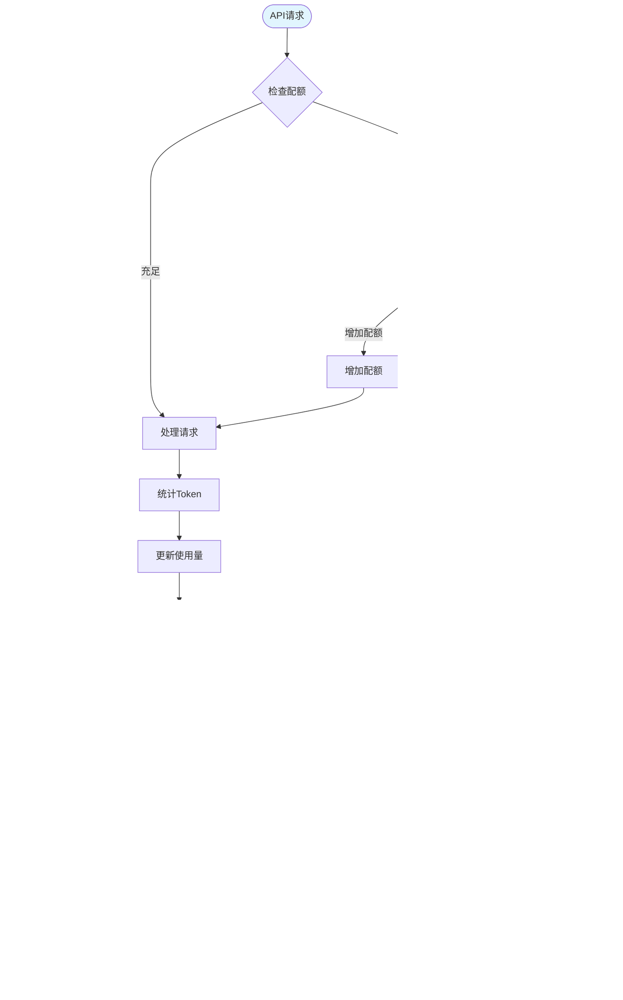

# RAG系统用户操作流程图

**版本**: 1.0  
**日期**: 2025年8月12日

---

## 一、核心业务流程

### 1.1 文档处理全流程

### 1.2 智能检索流程

### 1.3 策略配置流程

---

## 二、异常处理流程

### 2.1 文档解析失败处理

### 2.2 系统降级流程

---

## 三、权限管理流程

### 3.1 角色权限分配

---

## 四、数据同步流程

### 4.1 增量同步流程

---

## 五、A/B测试流程

### 5.1 策略A/B测试

---

## 六、告警处理流程

### 6.1 告警响应机制

---

## 七、用户反馈流程

### 7.1 反馈收集与处理

---

## 八、知识图谱构建流程

### 8.1 实体关系抽取

---

## 九、成本控制流程

### 9.1 Token使用监控

---

## 十、数据备份恢复流程

### 10.1 自动备份流程

---

## 🎯 流程设计要点总结

### 关键优化点：

1. **并行处理**: 多路召回、批量操作并行执行
2. **容错机制**: 每个关键节点都有失败处理路径
3. **降级策略**: 4级降级确保服务可用性
4. **人机协同**: 自动处理+人工审核结合
5. **闭环反馈**: 用户反馈驱动持续优化

### 你忽略的流程细节：

1. **预热机制**: 冷启动时的缓存预热流程
2. **回滚能力**: 所有配置变更可一键回滚
3. **影子测试**: 新策略先影子模式运行
4. **容量规划**: 基于历史数据预测扩容需求
5. **合规审计**: 敏感操作全程留痕

这些流程图可以直接用于：
- 开发团队理解业务逻辑
- 测试团队设计测试用例
- 运维团队制定SOP
- 产品团队优化体验